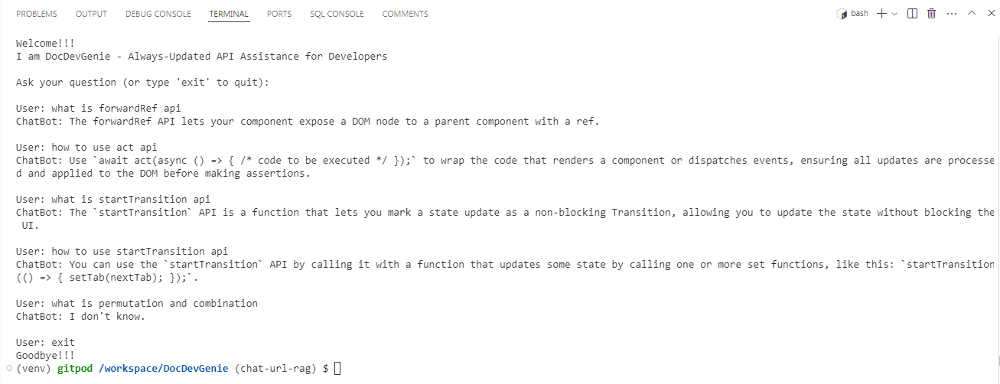

# DocDevGenie - Always-Updated API Assistance for Developers

### Overview
DocDevGenie is an intelligent chatbot designed to provide concise and accurate answers to questions related to web APIs, documentation, and development topics. It utilizes the Retrieval-Augmented Generation (RAG) approach, integrating a large language model (LLM) powered by GROQ and data fetched dynamically from various web sources using Apify.

### Features
- Real-time Web Scraping: Fetches the most recent data from websites using Apify.
- Efficient Text Processing: Uses RecursiveCharacterTextSplitter for optimized document chunking.
- Advanced Embeddings: Leverages the HuggingFaceEmbeddings model for generating context-aware embeddings.
- Dynamic Retrieval: Implements a similarity-based retrieval system using Chroma for fetching the most relevant pieces of information.
- Interactive Q&A: Provides a user-friendly CLI interface to answer developer-related questions dynamically.

### Requirements
- Python 3.8 or later
- Required Python packages (install using requirements.txt):
    - groq
    - dotenv
    - langchain_groq
    - langchain
    - langchain_huggingface
    - langchain_community
    - apify-client

## Installation
1. Clone the Repository
```
git clone https://github.com/yourusername/DocDevGenie.git
cd DocDevGenie
```

2. Create Virutal Environment
```
python -m venv venv
source venv/bin/activate
```

3. Install Dependencies
```
pip install -r requirements.txt
```

4. Set Up Environment Variables

Create a .env file in the root directory and add the following environment variables:
```
APIFY_API_TOKEN=your_apify_api_token
GROQ_API_KEY=your_groq_api_key
```
Replace your_apify_api_token and your_groq_api_key with your actual tokens.

## Usage
1. Run the Script
```
python app.py
```

2. Interact with DocDevGenie

- You will be prompted with a welcome message.
- Type your question related to API documentation or development.
- The chatbot will provide concise answers based on the most relevant data.
- To exit, type exit.

## Code Structure
- Apify Data Loading: Fetches data using ApifyClient and processes it using ApifyDatasetLoader.
- Text Splitting: Breaks down large documents into manageable chunks for efficient retrieval.
- Embeddings and Vector Store: Embeds the document chunks and stores them in a vector database using HuggingFaceEmbeddings and Chroma.
- Language Model: Uses GROQ's ChatGroq model to generate context-aware answers.
- Retrieval Chain: Combines the retriever and language model in a RetrievalQA chain to generate responses.

## Demo Snapshot
Here's a sample interaction with DocDevGenie:


### Note - DATASET ACCESS
Running an Actor might take time, depending on the Actor's complexity and the amount of data it processes. If you want only to get data and have an immediate response you should access the existing dataset of the finished Actor run.

## Contributing
Feel free to contribute by opening issues or creating pull requests. Your input is always welcome!

## License
This project is licensed under the MIT License. See the [LICENSE](LICENSE) file for details.

